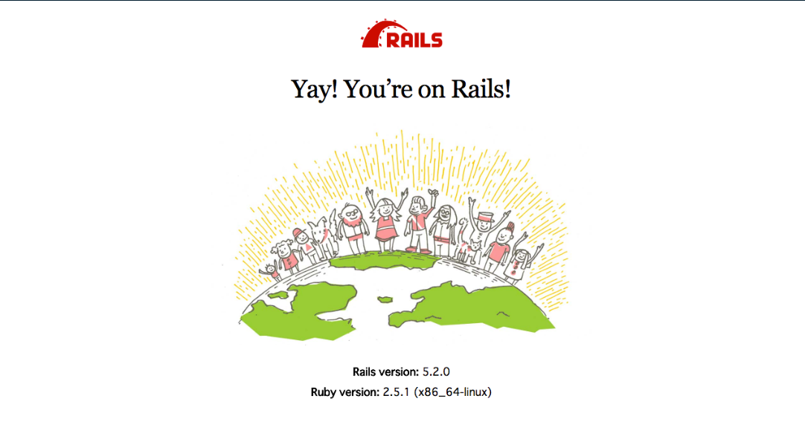

# Ruby on Rails and Docker.

This application was built using dockers conainers, Ruby and PostgreSQL.
All the information is placed in the Dockerfile and docker-compose.yml file.

For more information, you can visit: https://docs.docker.com/samples/rails/

## Set up.

* Create the Rails applcation with PostgreSQL: `rails new docker-rails-app -d=posgresql`.
* Create the Dockerfile and add all the commands in order to create the container.
* Create the docker-compose file to create the servers for Rails and for PostgreSQL.
* Create the entrypoin.sh file in the root path of the project.
* Build the project: `docker-compose run --no-deps web rails new . --force --database=postgresql`.
* Build the image: `docker compose build`.
* Go to config/database.yml and change the default configuration by adding the username and password for PostgreSQL.
* Boot the app by typping: `docker compose up`.

.

## Run commands inside of the container.

In order to run rails commands inside of the web container, we can do it by adding the following commands:

* In order to run rails db:create: `docker compose run web rails db:create db:migrate`.
* In order to run rails db:seed: `docker compose run web rails db:seed`.

## Softwares and frameworks.

* Docker image Ruby: 2.7.6 
* Ruby on Rails: 6.1.5.1
* Docker image PostgreSQL: 12.10
* VSCode.
* Windows 10(WSL 2, Linux).

## Author:

* Jorge Ortiz Mata.
* San Luis Potosí S.L.P. México
* ortiz.mata.jorge@gmail.com
* +52 (444) 576 3034.

